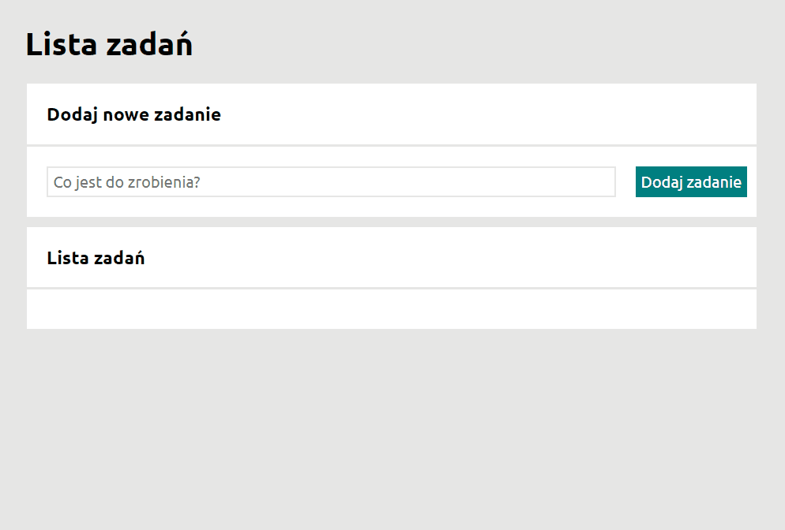

# TODO LIST
## to-do list
New version

It is a taks list. 

## Demo

https://waltad.github.io/TODO-LIST/

## Instruction
1. Enter the task.
2. Confirm the task and it will appear in the window at the bottom.
3. Repeat steps 1 and 2 until you have entered all tasks.
4. Click the icon on the left if you have completed the task.
5. Click the icon on the right if you want to delete the task.

## Tech

TODO LIST uses a number of open source projects to work properly:

- [HTML] - HyperText Markup Language
- [JS] - JavaScript
- [CSS] - Cascading Style Sheets
- [BEM] - Blocks, Elements and Modifiers
  
## Installation

No installation required

## Development

This project was done as part of an exercise in a Java Script course.
The project will be developed as new skills are acquired

## Lice

Free license